<!-- Heading -->
#  열번째 도토리

<!-- Quote -->
> ## 기초 복습
> 
> ### 고박사 유니티 2D 기초편 (2/3)

이번 강의 내용은 유튜브 고박사님의 인프런 무료 강의 유니티 기초 2D편 입니다

<br>
안녕하세요 코드 지식이 모자라 다람쥐가 도토리 모으듯이 여기저기서 긁어 모아 사용하다가

숨겨 놓은 도토리 까먹듯이 맨날 자료 못찾아서 뒤적거리는 다람쥐코더입니다

<br>

완전 기초에 이어서 이번엔 2D 기초 확실하게 다지고 갑니다!

<br>


### 유니티 2D 기초

이 장은 게임 오브젝트 이동, 게임 오브젝트 물리와 충돌, 게임 오브젝트 생성 함수, Instantiate() 활용 예제, 게임오브젝트 삭제 함수,

플랫폼 게임에서의 플레이어 이동과 점프 구현, 2D Sprite / Animation, 2D Animation 실습, 2D Tilemap Editor, 2D Tilemap 추가자료

등으로 구성이 됩니다

<br>

**게임 오브젝트 이동**

이전 기초 수업에서 배운 내용을 잠깐 복습하고 2D 오브젝트를 생성 합니다

그리고 스크립트도 생성하여 이름을 Movement 2D로 합니다

```c#
public class Movement2D : MonoBehavior
{
    private void Awake()
    {
        // 새로운 위치 = 현재 위치 + (방향 * 속도)
        transform.position = transform.position + new Vector3(1, 0, 0) * 1;
        
      // 아래의 코드는 위의 코드와 완전히 같은 기능을 합니다
      //transform.position += Vector3.right * 1;
    }
}
```
위의 코드는 Awake()에 작성되어 있기 때문에 실행되면 한번만 움직입니다

이를 Update()문에 넣으면 실행되는 동안 계속 움직이게 되며

transform.position += Vector3.right * 1 * Time.deltaTime;

여기서 Time.deltaTime의 개념이 나오는데

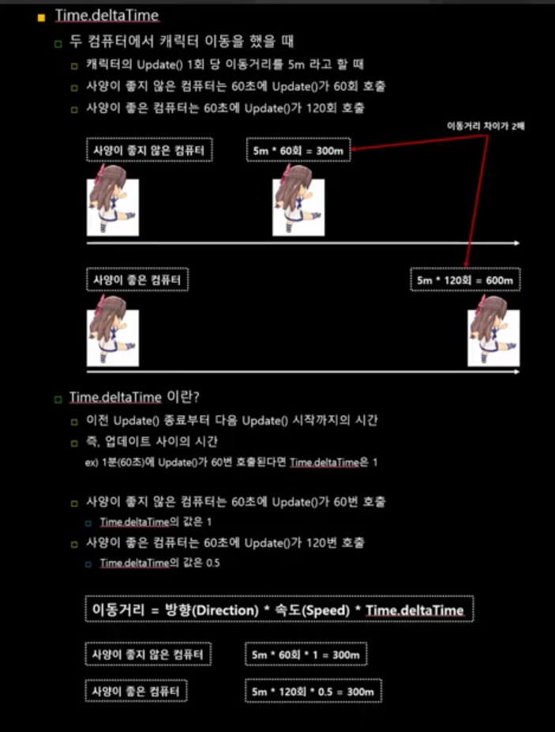

Update() 실행은 FPS에 따라 변화되기 때문에 이 차이를 없애기 위하여 사용합니다

다음은 조작을 위한 설정입니다

```c#
public class Movement2D : MonoBehavior
{
    private float moveSpeed = 5.0f;               // 이동속도
    private Vector3 moveDirection = Vector3.zero; // 이동방향

    private void Update()
    {
        // Positive Value +1 Right : d
        // Negative Value -1 Left  : a
        // None : 0
        float x = Input.GetAxisRaw("Horizontal"); // 좌우 이동
        
        // Positive Value +1 Up : w
        // Negative Value -1 Down  : s
        // None : 0
        float y = Input.GetAxisRaw("Vertical");   // 위아래 이동
        
        // 이동 방향 설정
        moveDirection = new Vector3(x, y, 0);
        
        // 새로운 위치 = 현재 위치 + (방향 * 속도)
        transform.position += moveDirection * moveSpeed * Time.deltaTime;
    }
}

```

위 코드를 실행하게 되면 w a s d로 원하는 방향으로 이동이 가능합니다

<br>

**게임오브젝트 물리와 충돌**

이번엔 물리충돌을 나타내는 RigidBody와 충돌 범위를 나타내는 Collider2D 컴포넌트를 학습하며

오브젝트 충돌시 발생하는 이벤트에 대해 학습합니다

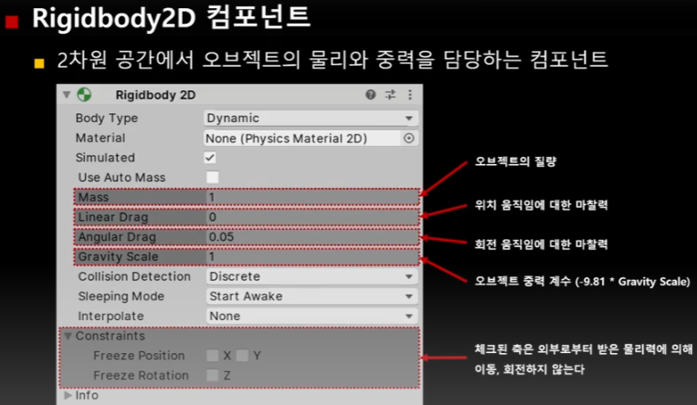

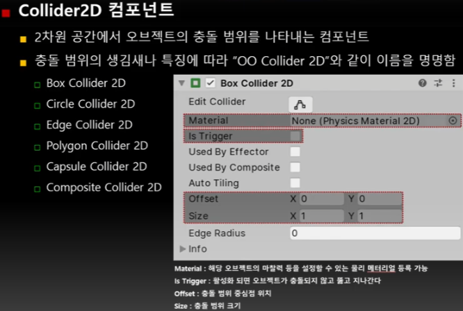

먼저 Circle Collider2D입니다

변수로 Offset은 충돌 범위 중심점

Radius는 충돌 범위 반지름 크기입니다

연산 속도가 가장 빠른 특징이 있습니다

Edge Collider2D는 점의 위치, 개수를 설정 할 수 있어 다양한 곡선 형태로 충돌 범위 표현이 가능합니다

주로 2D 게임의 바닥 충돌에 사용됩니다

변수로는 Offset 충돌 범위 중심점

Edge Radius 충돌 선의 두께

Points 선을 이루는 점의 개수와 각 점의 위치가 있습니다

Polygon Collider 2D는 텍스처의 모양과 비슷한 형태로 충돌 범위를 생성하며

Edge와 마찬가지로 Points 수정이 가능합니다

변수로는 Offset 충돌 범위 중심점

Points 선을 이루는 점의 개수와 각 점의 위치가 있습니다

세밀한 충돌이 가능하지만 연산량이 늘어나기 때문에 꼭 필요한 경우에만 사용합니다

Capsule Collider 2D는 캡슐 모양의 충돌 범위를 생성하며 사람 형태의 캐릭터에 주로 사용됩니다

변수로는

마찬가지로 Offset

Size 충돌 범위

Direction 둥근 캡슐이 표현되는 방향이 있습니다

Composite Collider 2D는 다른 게임 오브젝트의 Collider 2D들을 하나로 묶어주는 역할을 합니다

하지만 BoxCollider 2D와 Polygon Collider 2D 만 가능합니다

다음은 자세한 Composite Collider 2D의 사용법입니다

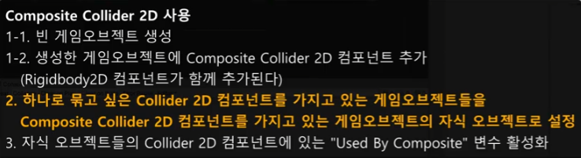

사용 후에는 이런 차이가 있습니다

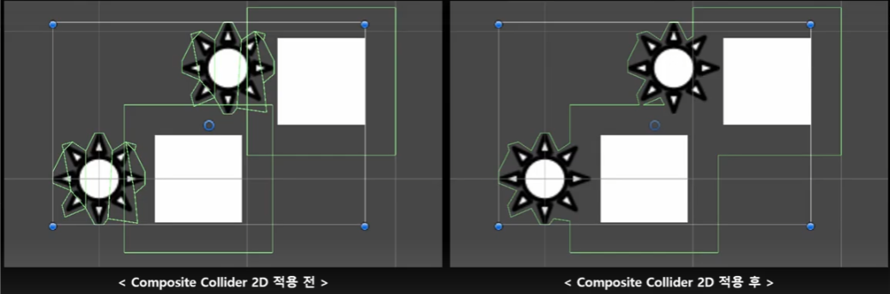

두 오브젝트가 충돌하기 위해선 조건이 있습니다

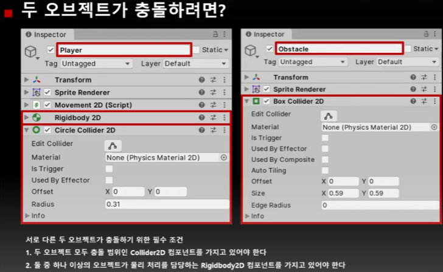

아까 사용했던 코드를 다시보겠습니다
```c#
public class Movement2D : MonoBehaviour
{
    private float moveSpeed = 5.0f;               // 이동속도
    private Rigidbody2D rigid2D;

    private void Awake()
    {
        rigid2D = GetComponent<Rigidbody2D>();
    }
    
    private void Update()
    {
        // Positive Value +1 Right : d
        // Negative Value -1 Left  : a
        // None : 0
        float x = Input.GetAxisRaw("Horizontal"); // 좌우 이동
        
        // Positive Value +1 Up : w
        // Negative Value -1 Down  : s
        // None : 0
        float y = Input.GetAxisRaw("Vertical");   // 위아래 이동
        
        // 이동 방향 설정
        moveDirection = new Vector3(x, y, 0);
        
        // 새로운 위치 = 현재 위치 + (방향 * 속도)
        // transform.position += moveDirection * moveSpeed * Time.deltaTime;
        
        // Rigidbody2D 컴포넌트에 있는 속력(velocity) 변수 설정
        rigid2D.velocity = new Vector3(x, y, 0) * moveSpeed;
    }
}

```

충돌 종류로는

OnCollisionEnter2D() : 두 오브젝트가 충돌하는 순간 1회 호출

OnCollisionStay2D() : 충돌 직후 맞닿아 있는 동안 매 프레임 호출

OnCollisionExit2D() : 두 오브젝트가 떨어져서 충돌이 종료되는 순간 1회 호출

매개변수 Collision2D collision

코드 예시입니다
```c#

    private void Awake()
    {
        spriteRenderer = GetComponenet<SpriteRenderer>();
    }
    
    private void OnCollisionEnter2D(Collision2D collision)
    {
        priteRenderer.color = color;
    }
    private void OnCollisionStay2D(Collision2D collision)
    {
        Debug.Log(gameObject.name + " : OnCollisionStay2D() 메소드 실행");
    }
    private void OnCollisionExit2D(Collision2D collision)
    {
        spriteRenderer.color = Color.white;
    }
    
```
위의 코드는 벽에 닿으면 벽의 색깔을 변경하고 닿아있는 동안 실행되고 있음을 디버깅 출력하며 떨어지면 다시 흰색으로 돌아갑니다

다음으로는 물리적인 충돌 없이 이벤트 함수가 호출되는 함수들입니다

OnTriggerEnter2D() : 두 오브젝트가 충돌하는 순간 1회 호출

OnTriggerStay2D() : 충돌 직후 맞닿아 있는 동안 매 프레임 호출

OnTriggerExit2D() : 두 오브젝트가 떨어져서 충돌이 종료되는 순간 1회 호출

매개 변수는 마찬가지로 같습니다

다음은 코드 예시입니다

```c#

public class TriggerEvent : MonoBehaviour
{  
    [SerializeField]
    private GameObject moveObject;
    [SerializeField]
    private Vector3 moveDirection;
    private float moveSpeed;  
   
    private void Awake()
    {
        MoveSpeed = 5.0f;
    }
    
    private void OnTriggerEnter2D(Collision2D collision)
    {
        // moveObject 오브젝트의 색상을 검은색(Color.black)으로 설정한다
        moveObject.GetComponent<SpriteRenderer>().color = Color.black;
    }
    private void OnTriggerStay2D(Collision2D collision)
    {
        // moveObject 오브젝트를 moveDirection 방향으로 이동한다
        moveObject.transform.position += moveDirection * moveSpeed * Time.deltaTime;
        
    }
    private void OnTriggerExit2D(Collision2D collision)
    {
        // moveObject 오브젝트의 색상을 다시 흰색(Color.white)로 변경한다
        moveObejct.GetCompoenet<SpriteRenderer>().color = Color.White;
        // moveObject 오브젝트의 위치를 (0, 4, 0)으로 설정한다
        moveObejct.transform.position = new Vector(0, 4, 0);
    }
}    
```

위 코드를 실행하고 충돌하면 moveObject로 설정된 오브젝트의 위치를 변경합니다

<br>

**게임 오브젝트 생성 함수**

게임 내에서 복제 생성을 하기 위해서는 원본이 되는 복제 생성이 필요합니다

여기서 원본이 되는 오브젝트는 프리팹을 사용합니다

오브젝트를 생성하고 이미지나 여러가지 설정을 한 후 Hierarchy창에서 Project 폴더로 옮기면

프리팹이 생성 됩니다

그리고 다시 Project 창에서 Hierarchy창으로 복제해서 생성합니다

물론 앞으로는 C# 프로그래밍을 통해 생성하게 될 것 입니다

```c#
public class ObjectSpawner : MonoBehaviour
{
    [SerializeField]
    private GameObject boxPrefab;
    
    private void Awake()
    {
        // Instantiate(GameObject original, Vector3 position, Quaternion rotation);
        // original 프리팹을 복제해서 생성하고 생성된 복제본의 위치를 position으로 회전을 rotation으로 설정
        Instantiate(boxPrefab, new Vector3(3, 3, 0), Quaternion.identity);
    }
}
```
회전 정보를 나타내고 연산하는 방식은 오일러(Euler)와 쿼터니온(Quaternion)이 있습니다

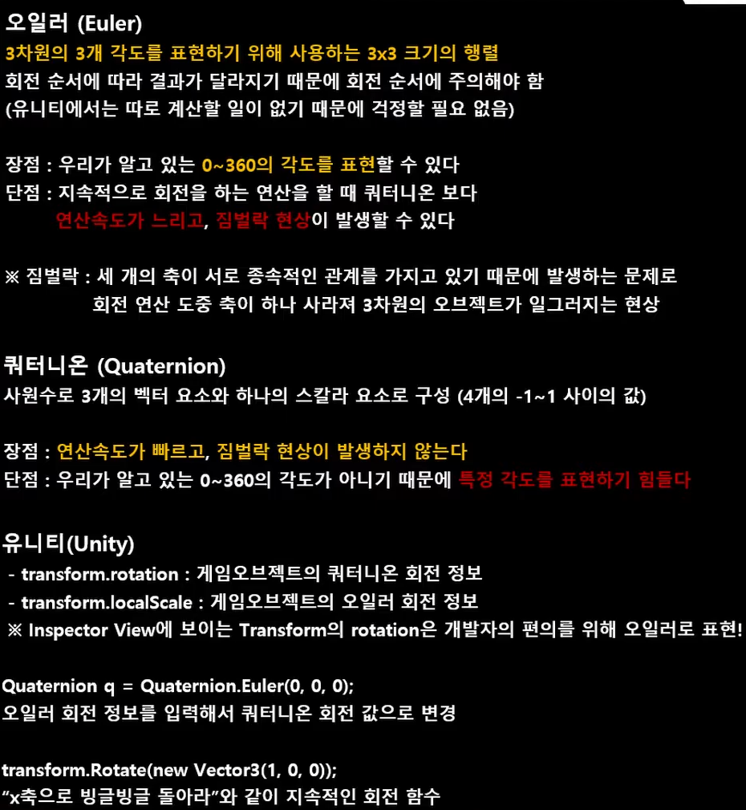

**Instatiate() 활용 예제**

신나게 예제를 따라하다보니 글 작성을 못하고 있었네요 코드 내에 주석으로 설명을 첨부 합니다

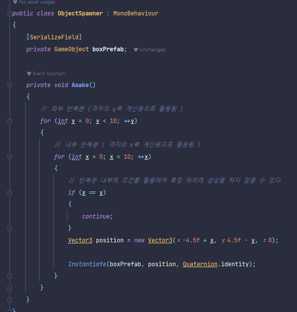

그리고 이를 실행 하게되면 x값과 y값이 같은 대각선 라인이 생성되지 않는것을 볼 수 있습니다

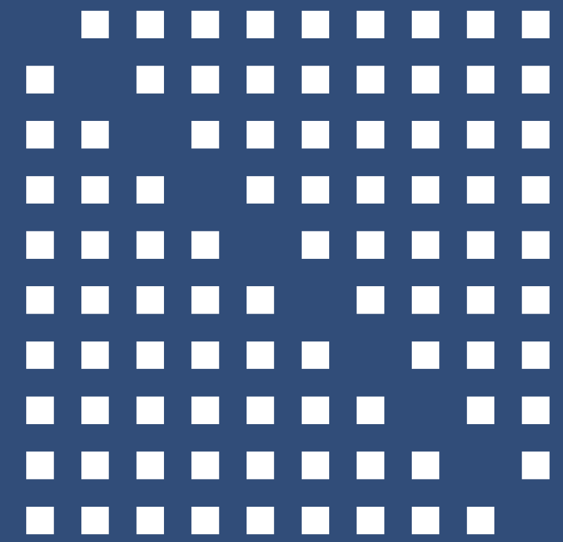

여러가지 모양 해보기

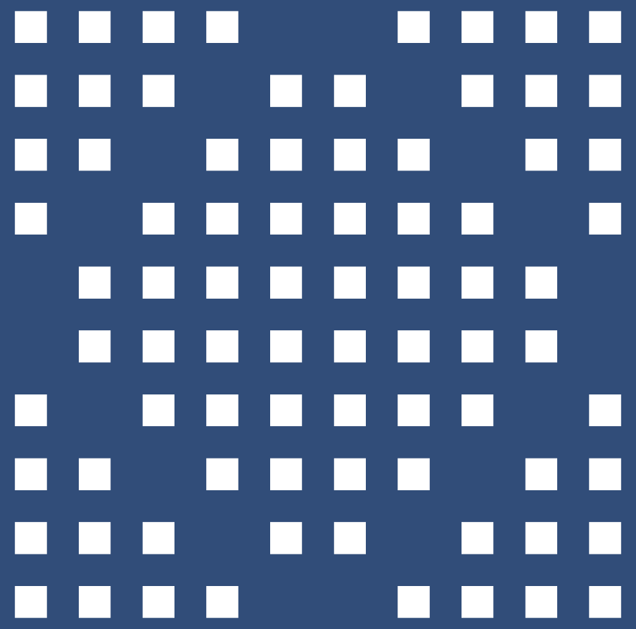

다음은 프리팹중 임의의 프리팹이 생성되도록 해보겠습니다

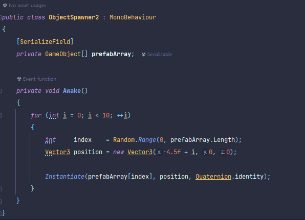

라이더가 Random 이 다른 Random이 되는 이슈가 있네요

실행 결과 입니다

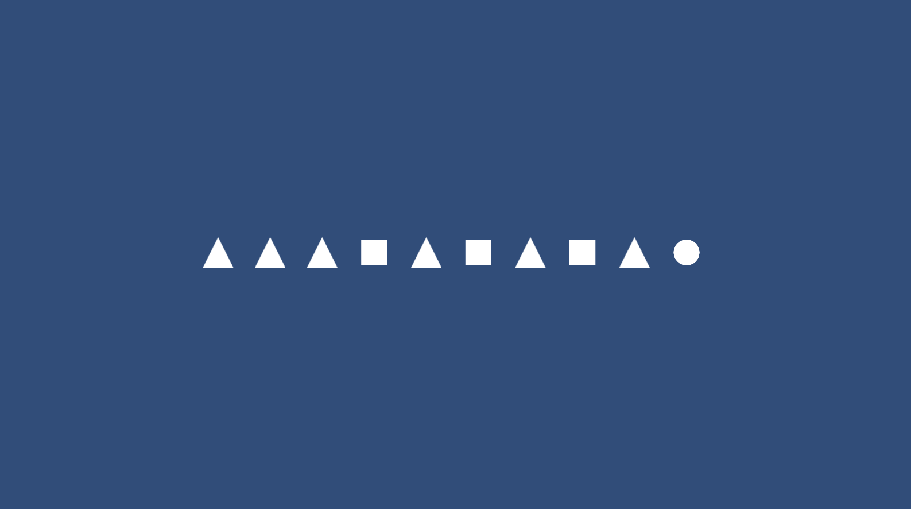

매번 결과가 다르게 나옵니다

다음은 스폰 위치도 랜덤으로 바꿔 보겠습니다

생성 위치값도 랜덤으로 해준 뒤
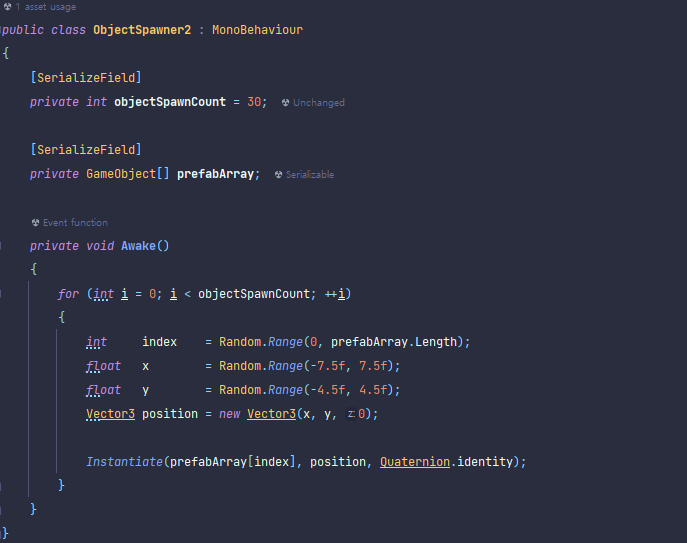

실행 결과 입니다

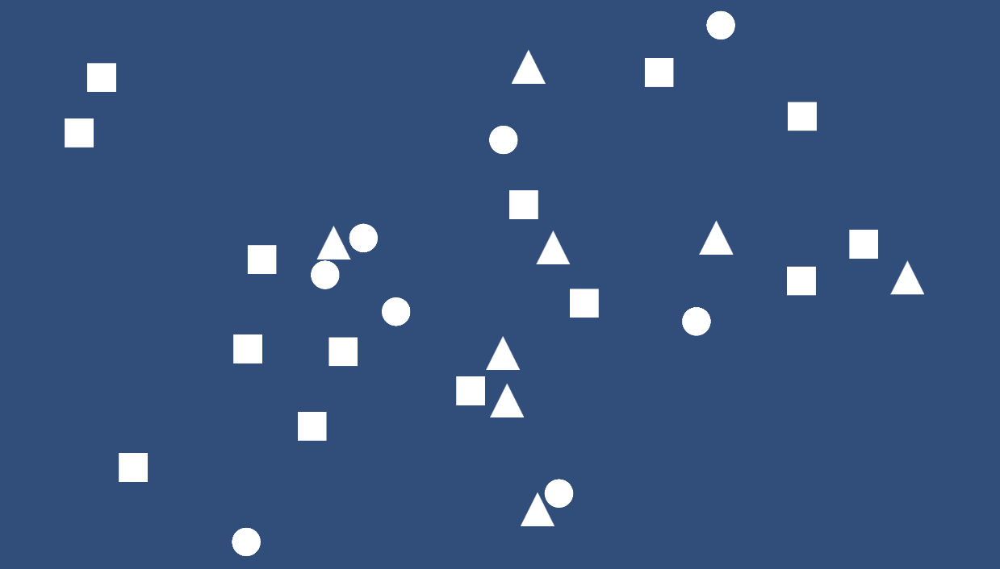

다음은 스폰포인트를 지정하여 생성을 해보도록 하겠습니다

먼저 저번 시간에 사용한 움직이는 스크립트를 조금 수정해서 만듭니다

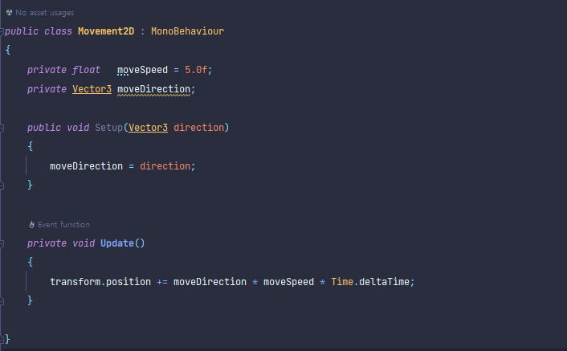

그리고 오브젝트 스포너의 코드를 수정합니다

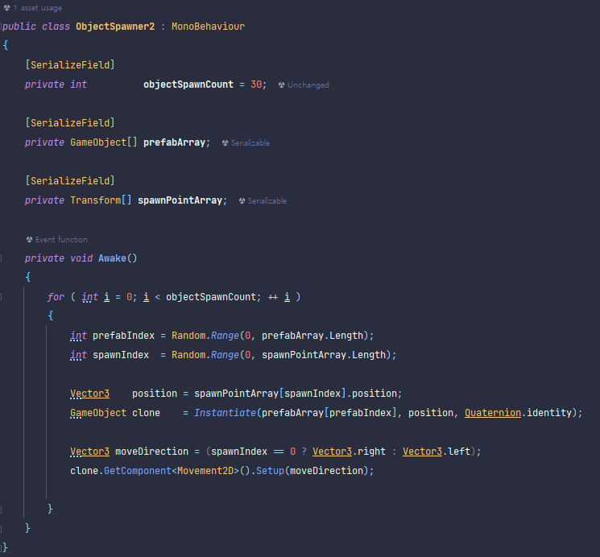

내용중에 삼항 연산자가 있습니다

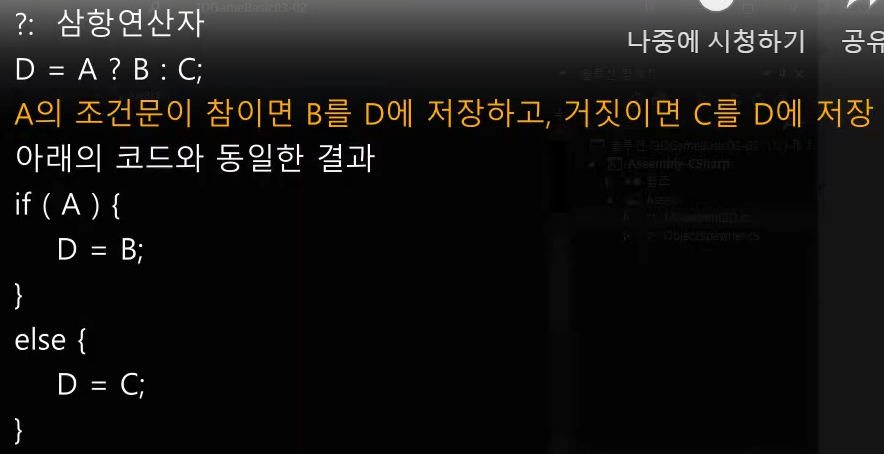

그리고 최종 수정 입니다 사진엔 변수가 짤렸지만 가운데가 중요하니 내용만 보겠습니다

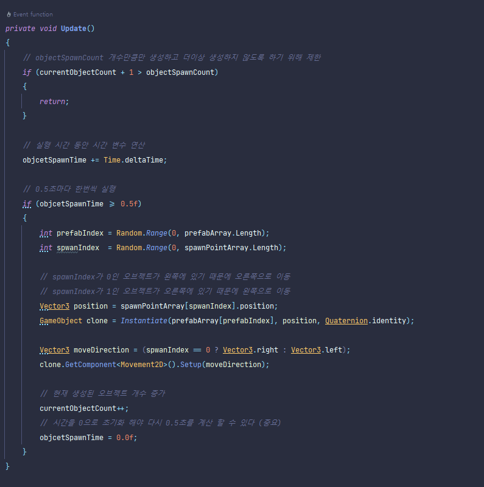

결과 실행 화면

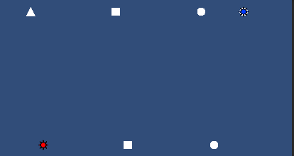

그리고 플레이어를 추가하고 플레이어 스크립트도 작성합니다

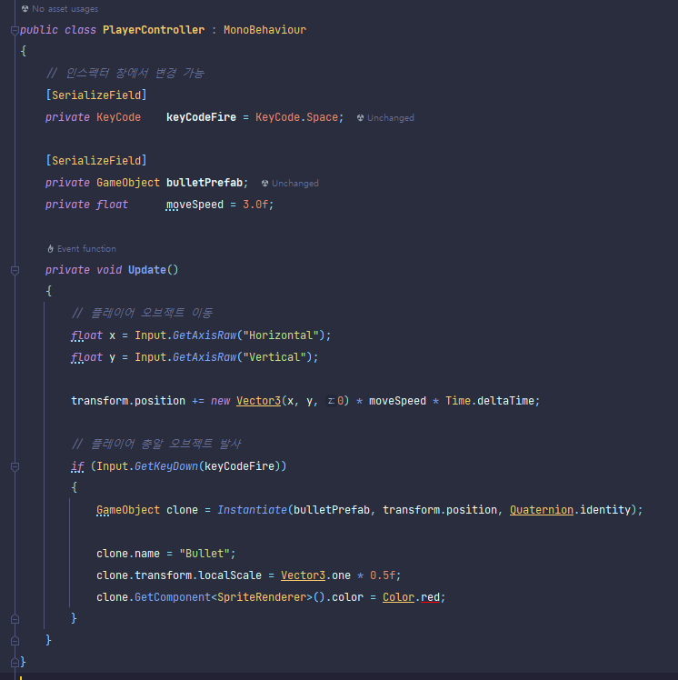

실행 화면입니다

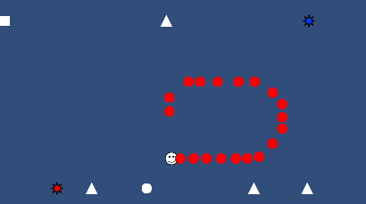

플레이어는 정상적으로 움직이지만 아직 총알이 움직이지 않는 모습입니다

코드를 수정해서 플레이어가 마지막으로 움직인 방향으로 총알을 발사하도록 합니다

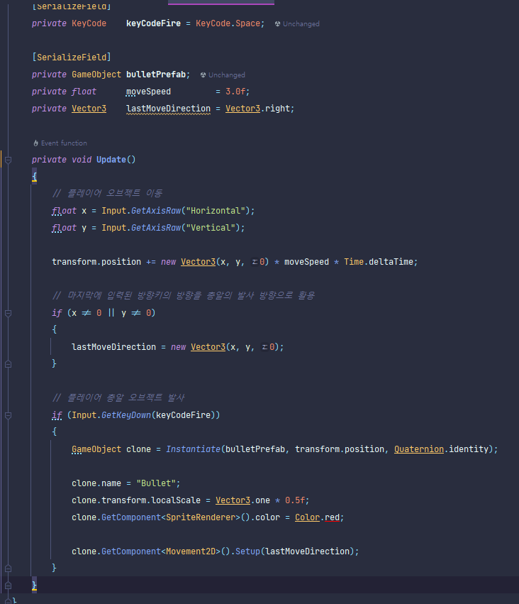

최종 실행 모습입니다

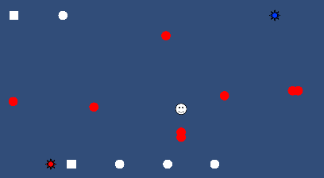

**게임오브젝트 삭제 함수**


## 이번장을 마치며

대부분 알았던 것들이지만 기초가 제일 중요하기에 자세히 하나하나 정독하며 들었습니다

몰랐던 것들도 있었고 아는것들도 확실하게 확인하게 되었습니다

역시 자만은 금물입니다
