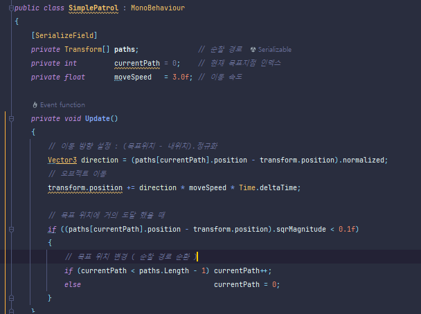

<!-- Heading -->
#  열한번째 도토리

<!-- Quote -->
> ## 기초 복습
> 
> ### 고박사 유니티 2D 기초편 (3/3)

이번 강의 내용은 유튜브 고박사님의 인프런 무료 강의 유니티 기초 3D편 입니다

<br>
안녕하세요 코드 지식이 모자라 다람쥐가 도토리 모으듯이 여기저기서 긁어 모아 사용하다가

숨겨 놓은 도토리 까먹듯이 맨날 자료 못찾아서 뒤적거리는 다람쥐코더입니다

<br>

2D 기초에 이어 3D 기초입니다 기초 완전 다지기 시작합니다

<br>


### 유니티 3D 기초

이 장은 CharacterController 기반의 오브젝트 이동, Navigation Mesh기초, Navigation Mesh 응용, 3D Model / Animations,

Animation Layer, Blend Tree, Animation Layer & Blend Tree, 실습, 3D Animations / Simple Combat, Terratin Map

등으로 구성이 됩니다

<br>

**CharacterController 기반의 오브젝트 이동**

3D에서는 Material을 생성해서 색상을 지정해 줄 수 있습니다

CharacterController는 캐릭터의 움직임, 제어를 위해 사용하며 캡슐 형태의 충돌 범위가 포함되어 있습니다

따라서 기존에 있던 Player의 CapsuleCollider는 삭제합니다

그리고 움직임을 위한 스크립트를 생성합니다


다음은 플레이어를 제어하는 스크립트를 생성합니다


하지만 현재 중력처리가 없는 상태입니다 이를 우리는 코드를 활용해 넣어봅니다

방향 설정을 위한 세팅도 추가하여 스크립트를 수정합니다


다음은 점프를 구현해 봅니다

Movement3D 코드엔 땅인지를 체크하는 점프 함수를 생성하고

CharacterController 코드에서 점프 키 입력시 점프 함수를 실행 시킵니다

그리고 Slope Limit는 오를 수 있는 경사면 각도이고

Step Offset은 오를 수 있는 계단의 높이 값입니다


1인칭으로 바꾸기 위해선 메인카메라를 플레이어에게 상속시키고 위치를 조정합니다

하지만 아직 카메라의 움직임을 설정하지 않았음으로 스크립트를 생성합니다


그이후로 Movement3D와 CharacterController도 수정을해주면

1인칭으로 캐릭터의 시첨이 마우스따라 움직이며 키보드로 본체의 움직임을 제어하는 기초가 완성됩니다

**Navigation Mesh기초**

NavMesh는 유니티에서 제공하는 경로 탐색 기능입니다


그리고 Navigation 탭의 Agents 요소 설명입니다


다음은 Areas 요소 자료입니다


다음은 Bake 탭입니다


마지막으로 Object 탭입니다


현재 씬의 GameObject를 Static으로 지정하고 Bake를 실행하면 다음과 같은 상태가 됩니다


하늘색 부분은 이동가능한 부분이고 나머지 부분은 이동이 불가능한 부분입니다

현재 Bake탭의 MaxSlope값이 45도이기 때문에 50경사를 가진 길은 이동이 불가능한 상태입니다

또한 Step Height의 값을 설정하여 오를 수 있는 계단의 높이도 지정 할 수 있습니다

그리고 플레이어를 생성한뒤 NavMeshAgent 컴포넌트를 삽입합니다


그리고 관련된 스크립트를 작성 후

잠시 우리가 오브젝트를 어떻게 제어하는지 방식에 대해 알아봅니다


그리고 PlayerController 스크립트도 설정 해 줍니다


이렇게 완성 후 실행하면 플레이어가 클릭한 위치로 자동으로 이동하는 것을 확인 할 수 있습니다


**Navigation Mesh 응용**

이번 강의는 저번 강의와 이어집니다


설정 하는 방법은 자동과 수동 두가지가 있으며 각각 장단점이 있습니다


그리고 자동으로 지정하게 되면 NavMesh에 새로운 경로가 표시되며 이동 불가능 하던 지역을 오르 내릴 수 있게됩니다

그다음은 수동입니다 오브젝트를 Start 지점과 End 지점에 배치한 후

부모 오브젝트에 OffMeshLink 컴포넌트를 추가한후 Start End를 배치합니다

그리고 옵션중 Bi Direction의 체크를 풀게되면 단일방향으로만 이동이 가능합니다

그리고 실행하면 자동과 마찬가지로 수동으로 설정해둔 사다리를 오르 내릴 수 있게 됩니다

다음은 Layer의 이동 비용 값을 크게 하여 우선 경로를 설정 해 봅니다

이것은 Area에서 설정가능하며 추가가 되었는지 NavMeshAgent컴포넌트에서 확인 할 수 있습니다

그리고 이와같은 특수한 움직임을 제어하기 위한 코드를 생성합니다

이부분은 굉장히 길기 때문에 직접 코드를 복사해 옵니다

```c#
public class OffMeshLinkClimb : MonoBehaviour
{
    [SerializeField]
    private int          offMeshArea = 3;       // 오프메시의 구역 (Climb)
    [SerializeField]
    private float        climbSpeed  = 1.5f;    // 오르내리는 이동 속도

    private NavMeshAgent navMeshAgent;

    private void Awake()
    {
        navMeshAgent = GetComponent<NavMeshAgent>();
    }

    IEnumerator Start()
    {
        while (true)
        {
            // IsOnClimb() 함수의 반환 값이 true일 때 까지 반복 호출
            yield return  new WaitUntil(() => IsOnClimb());
            // 올라가거나 내려오는 행동
            yield return StartCoroutine(ClimbOrDescend());
        }
    }

    public bool IsOnClimb()
    {
        // 현재 오브젝트의 위치가 OffMeshLink에 있는지 (true, false)
        if (navMeshAgent.isOnOffMeshLink)
        {
            // 현재 위치에 있는 OffMeshLink의 데이터
            OffMeshLinkData linkData = navMeshAgent.currentOffMeshLinkData;
            
            // 설명 : navMeshAgent.currentOffMeshLinkData.offMeshLink가
            // true이면 수동으로 생성한 OffMeshLink
            // false이면 자동으로 생성한 OffMeshLink
            
            // 현재 위치에 있는 OffMeshLink가 수동으로 생성한 OffMeshLink이고, 장소 정보가 "Climb"이면
            if (linkData.offMeshLink != null && linkData.offMeshLink.area == offMeshArea)
            {
                return true;
            }
        }
        return false;
    }

    private IEnumerator ClimbOrDescend()
    {
        // 네비게이션을 이용한 이동을 잠시 중지
        navMeshAgent.isStopped = true;
        
        // 현재 위치에 있는 OffMeshLink의 시작과 종료 위치
        OffMeshLinkData linkData = navMeshAgent.currentOffMeshLinkData;
        Vector3 start = linkData.startPos;
        Vector3 end   = linkData.endPos;
        
        // 오르내리는 시간 설정
        float climbTime   = Mathf.Abs(end.y - start.y) / climbSpeed;
        float currentTime = 0.0f;
        float percent     = 0.0f;

        while (percent < 1)
        {
            // 단순히 deltaTime만 더하면 무조건 1초 후에 percent가 1이 되기 때문에
            // climbTime 변수를 연산해서 시간을 조절한다
            currentTime += Time.deltaTime;
            percent = currentTime / climbTime;
            // 시간 경과(최대 1)에 따라 오브젝트의 위치를 바꿔준다
            transform.position = Vector3.Lerp(start, end, percent);

            yield return null;
        }
        
        // OffMeshLink를 이용한 이동 완료
        navMeshAgent.CompleteOffMeshLink();
        // OffMeshLink 이동이 완료되었으니 네비게이션을 이용한 이동을 다시 시작
        navMeshAgent.isStopped = false;
    }
    
}
```

다음은 점프하는 부분을 다르게 하는 코드를 작성해 봅니다

마찬가지로 엄청 길기 때문에 코드로 올립니다

```c#
public class OffMeshLinkJump : MonoBehaviour
{
    [SerializeField]
    private float        jumpSpeed = 10.0f;  // 점프 속도
    [SerializeField]
    private float        gravity   = -9.81f; // 중력 계수
    private NavMeshAgent navMeshAgent;

    private void Awake()
    {
        navMeshAgent = GetComponent<NavMeshAgent>();
    }

    IEnumerator Start()
    {
        while (true)
        {
            // IsOnJump() 함수의 반환 값이 true일 때 까지 반복 호출
            yield return new WaitUntil(() => IsOnJump());
            
            // 점프 행동
            yield return StartCoroutine(JumpTo());
        }
    }

    public bool IsOnJump()
    {
        if (navMeshAgent.isOnOffMeshLink)
        {
            // 현재 위치에 있는 OffMeshLink의 데이터
            OffMeshLinkData linkData = navMeshAgent.currentOffMeshLinkData;
            
            // 설명 OffMeshLinkType은 Manual = 0, DropDown = 1, JumpAcross = 2로
            // 자동으로 생성한 OffMeshLink의 속성 구분을 위해 사용 (1, 2)
            
            // 현재 위치에 있는 OffMeshLink의 OffMeshLinkType이 JumpAcross이면
            if (linkData.linkType == OffMeshLinkType.LinkTypeJumpAcross ||
                linkData.linkType == OffMeshLinkType.LinkTypeDropDown)
            {
                return true;
            }
        }

        return false;
    }

    IEnumerator JumpTo()
    {
        // 네비게이션을 이용한 이동을 잠시 중지한다
        navMeshAgent.isStopped = true;
        // 현재 위치에 있는 OffMeshLink의 시작과 종료 위치
        OffMeshLinkData linkData = navMeshAgent.currentOffMeshLinkData;
        Vector3 start = transform.position;
        Vector3 end   = linkData.endPos;
        
        // 뛰어서 이동하는 시간 설정
        float jumpTime    = Mathf.Max(0.3f, Vector3.Distance(start, end) / jumpSpeed);
        float currentTime = 0.0f;
        float percent     = 0.0f;
        
        // y 방향의 초기 속도
        float v0 = (end - start).y - gravity;

        while (percent < 1)
        {
            // 단순히 deltaTime만 더하면 무조건 1초 후에 percent가 1이 되기 때문에
            // jumpTime 변수를 연산하여 시간을 조절한다
            currentTime += Time.deltaTime;
            percent = currentTime / jumpTime;
            // 시간 경과 (최대 1)에 따라 오브젝트의 위치(x, z)를 바꿔준다
            Vector3 position = Vector3.Lerp(start, end, percent);
            // 시간 경과에 따라 오브젝트의 위치(y)를 바꿔준다
            // 포물선 운동 : 시작위치 + 초기속도 * 시간 + 중력*시간제곱
            position.y = start.y + (v0 * percent) + (gravity * percent * percent);
            // 위에서 계산한 x, y, z 위치 값을 실제 오브젝트에 대입한다
            transform.position = position;

            yield return null;
        }
        // OffMeshLink를 이용한 이동 완료
        navMeshAgent.CompleteOffMeshLink();
        // OffMeshLink 이동이 완료되었으니 네비게이션을 이용한 이동을 다시 시작한다
        navMeshAgent.isStopped = false;
    }
}

```
~~(와 뭐하나 진짜 간단한게 없네요)~~

그리고 플레이어가 아닌 이동하는 장애물의 경우

NavMeshObstacle이라는 컴포넌트를 사용합니다


그리고 지정된 경로를 자동으로 이동하는 스크립트를 작성합니다



이스크립트를 큐브에 넣고 NavMeshObstacle 컴포넌트를 넣으면

자동으로 움직이면서 이동경로를 방해합니다

그리고 카메라 움직임을 설정하는 스크립트도 제작합니다

```c#
public class CameraController : MonoBehaviour
{
    [SerializeField]
    private Transform target;            // 카메라가 추적하는 대상
    [SerializeField]
    private float     minDistance = 3;   // 카메라와 target의 최소 거리
    [SerializeField]
    private float     maxDistance = 30;  // 카메라와 target의 최대 거리
    [SerializeField]
    private float     wheelSpeed  = 500; // 마우스 휠 스크롤 속도
    [SerializeField]
    private float     xMoveSpeed  = 500; // 카메라의 y축 회전 속도
    [SerializeField]
    private float     yMoveSpeed  = 250; // 카메라의 x축 회전 속도
    private float     yMinLimit = 5;     // 카메라 x축 회전 제한 최소 값
    private float     yMaxLimit = 80;    // 카메라 x축 회전 제한 최대 값
    private float     x, y;              // 마우스 이동 방향 값
    private float     distance;          // 카메라와 target의 거리

    private void Awake()
    {
        // 최초 설정된 target과 카메라의 위치를 바탕으로 distance 값 초기화
        distance = Vector3.Distance(transform.position, target.position);
        // 최초 카메라의 회전 값을 x, y 변수에 저장
        Vector3 angles = transform.eulerAngles;
        x = angles.x;
        y = angles.y;
    }

    private void Update()
    {
        if (target == null) return; // target이 존재하지 않으면 실행 하지 않는다

        if (Input.GetMouseButton(1))
        {
            // 마우스를 x, y축 움직임 방향 정보
            x += Input.GetAxis("Mouse X") * xMoveSpeed * Time.deltaTime;
            y -= Input.GetAxis("Mouse Y") * yMoveSpeed * Time.deltaTime;
            // 오브젝트의 위 아래 (x)축 한계 범위 설정
            y = ClampAngle(y, yMinLimit, yMaxLimit);
            // 카메라의 회전(Rotation) 정보 갱신
            transform.rotation = Quaternion.Euler(y, x, 0);
        }
        // 마우스 휠 스크롤을 이용해 target과 카메라의 거리 값(distance) 조절
        distance -= Input.GetAxis("Mouse ScrollWheel") * wheelSpeed * Time.deltaTime;
        // 거리는 최소, 최대 거리를 설정해서 그 값을 벗어나지 않도록 한다
        distance = Mathf.Clamp(distance, minDistance, maxDistance);
    }

    private void LateUpdate()
    {
        if (target == null) return; // target이 존재하지 않으면 실행 하지 않는다
        
        // 카메라의 위치(position) 정보 갱신
        // target의 위치를 기준으로 distance만큼 떨어져서 쫒아간다
        transform.position = transform.rotation * new Vector3(0, 0, -distance) + target.position;
    }

    private float ClampAngle(float angle, float min, float max)
    {
        if (angle < -360) angle += 360;
        if (angle > 360) angle -= 360;

        return Mathf.Clamp(angle, min, max);
    }
}
```

이를 실행하면 플레이어 오브젝트가 움직이는것을 카메라가 쫒아다니는것을 확인 할 수 있습니다

또한 마우스를 통해 카메라를 회전할 수 있습니다

## 이번장을 마치며


