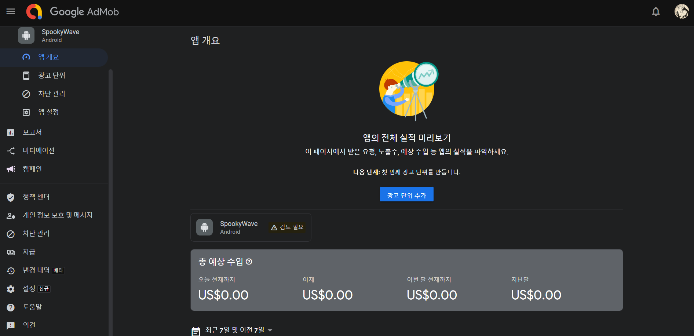
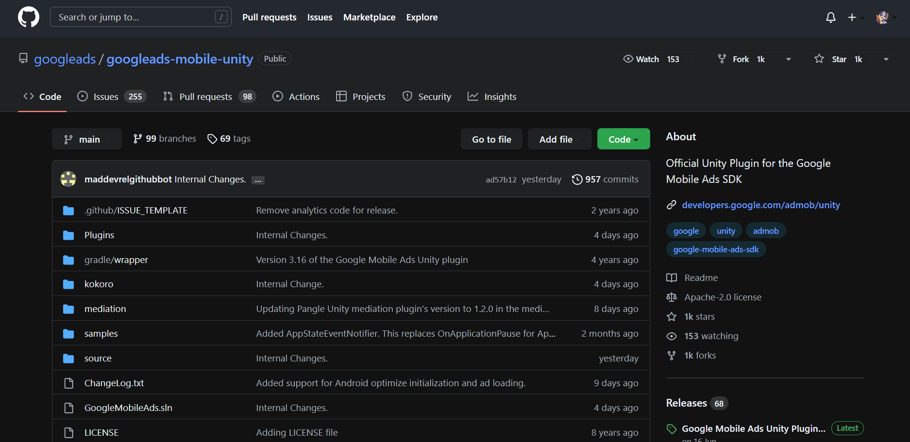
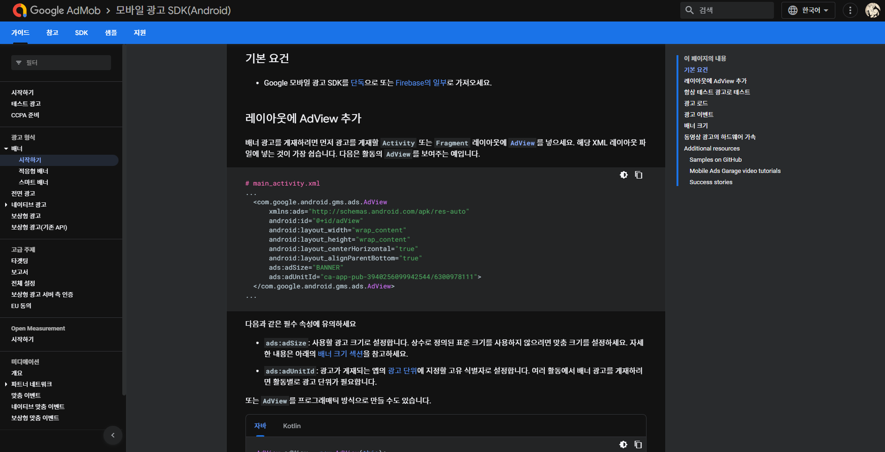
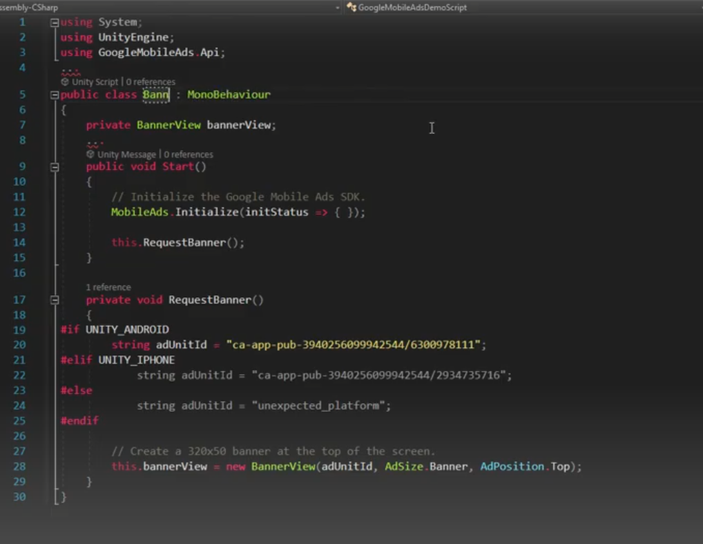
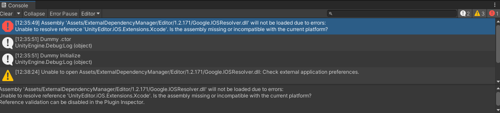

<!-- Heading -->
#  열네번째 도토리

<!-- Quote -->
> ## CS 개념 준비
> 
> ### 시간 복잡도

이번 학습은 노마드 코더님의 영상자료를 참고합니다

강의 내용은 유튜브 [노마드코더]https://www.youtube.com/watch?v=BEVnxbxBqi8님과
해외 유튜버 [Solo Game Dev]https://www.youtube.com/watch?v=KKL3k-Uk5JU 님의 영상을 참고하였습니다

 
안녕하세요 코드 지식이 모자라 다람쥐가 도토리 모으듯이 여기저기서 긁어 모아 사용하다가

숨겨 놓은 도토리 까먹듯이 맨날 자료 못찾아서 뒤적거리는 다람쥐코더입니다

 

취업하겠다고 개인 포트폴리오를 만들기 위해 하이퍼 캐쥬얼만 6개나 만들고나서

제일 퀄리티 좋게 완성된 작품을 출시할려고 합니다

~~(하는김에 광고도 넣어서 수익도 땡겨봅시다)~~

 

제일 먼저 구글 애드몹 사이트에 새로 가입을 합니다

짠! 저의 구글 애드몹 계정입니다

~~(무려 수익이 0.00원!)~~

그리고 구글 공식 플러그인을 깃허브에서 다운로드 합니다

그리고 나의 에셋에 임포트 한뒤

구글 애드몹 시작하기 탭에서

코드를 복사한후 유니티로 돌아가 빈 오브젝트와 스크립트를 생성해 줍니다

아 근데 왜 나는 사이트에 이상한 내용뿐일까 흑흑..

결국 손코딩 하기로합니다

근데 실행해보니 뭔가 오류가 생겼다

한참을 뒤져보니 iOS 모듈을 추가로 설치하면 해결된다 그래서 설치했다

그리고 유니티를 껏다키니 마법처럼 사라졌다! 고마워요 UWO스터디님

엥? 그리고 코드안에 값을 넣으면 끝이네요!

정말 간단합니다

이왕하는김에 출시까지 해버리겠습니다

라고 글을 적기 무섭게 빌드에 실패해서 6시간 넘게 고생하다가

지인 찬스로 해결하고 드디어 마켓에 업로드했습니다

구글 콘솔에 승인도 받아야하고 아직 절차가 많이 남았지만 과정중에

일일히 스크린샷을 남기지 못해서 포스팅은 마치겠습니다

## 이번 과정을 마치며

