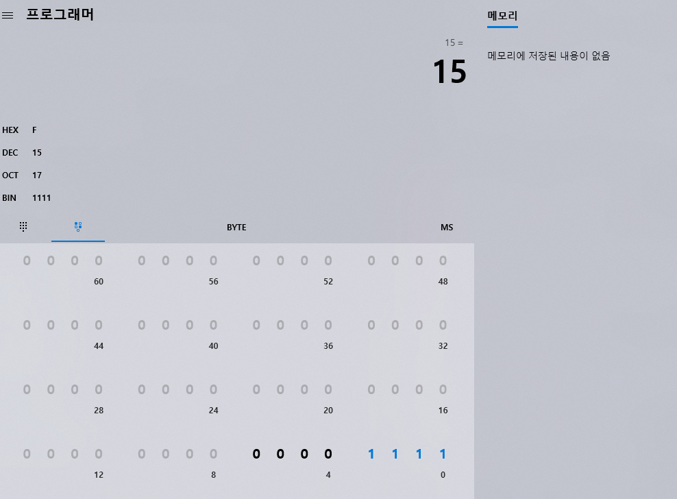

<!-- Heading -->
#  열네번째 도토리

<!-- Quote -->
> ## 인프런 유료강의 Rookiss님 강의
> 
> ### 1강 완전 입문 내용

이번 학습은 인프런 유료강의 [C#과 유니티로 만드는 MMORPG 게임 개발 시리즈](https://www.inflearn.com/course/%EC%9C%A0%EB%8B%88%ED%8B%B0-MMORPG-%EA%B0%9C%EB%B0%9C-part1/dashboard)
를 참고합니다

 
안녕하세요 코드 지식이 모자라 다람쥐가 도토리 모으듯이 여기저기서 긁어 모아 사용하다가

숨겨 놓은 도토리 까먹듯이 맨날 자료 못찾아서 뒤적거리는 다람쥐코더입니다

 

취업 해보겠다고 여기저기 이력서와 포트폴리오 넣고 첫 면접을 보고 왔습니다

원래 내일 두번째 면접인데 태풍 때문에 밀렸네요

각설하고 저의 실력 향상을 위해 비싸지만 유명한 유료강의 Rookiss님의 강의를 들어보도록 합니다

강의 사이즈가 사이즈인 만큼 한 Part마다 작은 규모의 포트폴리오도 만들어 볼 예정입니다

 

###데이터 갖고 놀기편 (정수 형식 1/8)

우선 기초적인 내용을 다시 다루게 됩니다

byte (1바이트 0~255), short(2바이트 -3만~3만), int(4바이트 -21억~21억), long(8바이트)

sbyte(1바이트 -128~127). ushort(2바이트 0~6만), uint(4바이트 0~43억), ulong(8바이트)

기획자들이 언제든지 바꿀 수 있기 때문에 항상 여유를 주도록 합시다

하지만 메모리를 크게 잡을수록 좋은건 아니니 적당한 선에서 사용합니다 ( 보통 int, long 정도 ) 

요거는 그냥 대략적으로 메모하고 넘어갑니다

###데이터 갖고 놀기편 (2진수, 10진수, 16진수 2/8)

우리가 프로그래밍할때 2진법 10진수 16진수를 숙지해야 한다고 합니다

10진수는 우리가 평소 쓰던 방식이라 문제 없지만

2진수나 16진수로 넘어가게 되면 좀 달라집니다

우리가 보기에는 컴퓨터의 언어라 매우 불편하지만

2진수 와 16진수끼리는 서로 변환이 부드럽습니다

###데이터 갖고 놀기편 (정수 범위의 비밀 3/8)

컴퓨터의 계산기에서 프로그래머 모드로하면

전 수업에서 배운 16진수 2진수등의 계산이 편리해집니다

벌써부터 신기하네요 HEX는 16진수 BIN은 2진수로 보여줍니다

## 이번 과정을 마치며

