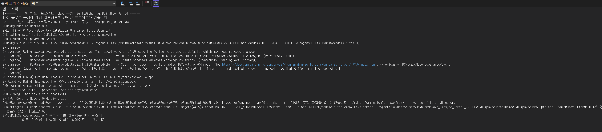
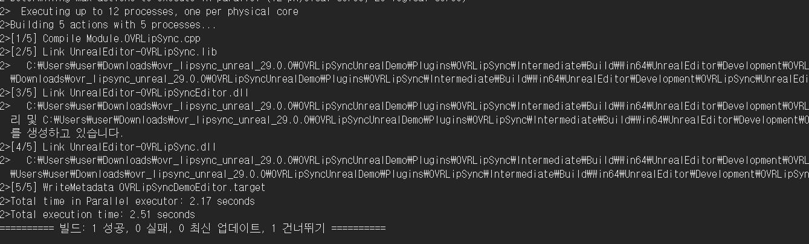

<!-- Heading -->
#  열일곱번째 도토리

<!-- Quote -->
> ## 언리얼 OVRlipsync Plugin을 Unreal 5.0.3에서 사용하기
>
> ### 버전 충돌 이슈 해결

이번 강의 내용은 언리얼 5.0.3에 구버전 플러그인을 사용하는 법을 알아봅니다

유튜브 [Fractured Fantasy님의 영상](https://www.youtube.com/watch?v=18ZzMLvqpS4&list=PLiWypE-cWk5gsYywl8DKFsJHUMS4scR-t&index=2)을 참고하여 제작합니다

 
안녕하세요 코드 지식이 모자라 다람쥐가 도토리 모으듯이 여기저기서 긁어 모아 사용하다가

숨겨 놓은 도토리 까먹듯이 맨날 자료 못찾아서 뒤적거리는 다람쥐코더입니다

 

입사 했기에 업무 내용은 업로드 할 수 없으나 작업하면서 까먹지 않도록 필요한 부분을 정리 하려고 합니다

 

### OVRlipsync plugin 다운로드하기

먼저 플러그인을 [Oculus 공식 홈페이지](https://developer.oculus.com/documentation/unreal/audio-ovrlipsync-unreal/)로가서 다운로드 합니다

다운로드 하게되면 압축을 풀고 sln 파일을 지워줍니다 그리고 uproject파일을 오른쪽 클릭하여 버전을 바꿔줍니다

여기서 만약 C++ (Visual Studio) 설치와 연동을 미리 해야지만 버전을 바꾸고 빌드 할 수 있습니다

확인하는 방법은 5.0.3 엔진을 실행 한 후 C++로 프로젝트가 생성되는지 확인합니다

그리고 나서 충돌이 발생할텐데 새로 생긴 OVRLipSyncDemo.sln을 visual studio 2022로 켜서 (2019로 키면 빌드 안됨 아마 로그인 안해서 같음..)

빌드를 실행하면 오류가 뜨게 됩니다 1 실패로 로그가 뜰텐데 여기서 오류 로그를 직접 확인한 후 찾아가야 하는데 아마도

OVRLipSyncUnreal503\OVRLipSyncUnreal503\Plugins\OVRLipSync\Source\OVRLipSyncEditor\Private 이폴더안에 있는

59번째 라인에 SoundWave->LoadingBehavior = ESoundWaveLoadingBehavior::ForceInline; 구문을 추가합니다

위의 자세한 내용은 [언리얼 포럼](https://forums.unrealengine.com/t/anyone-get-oculus-ovr-lipsync-plugin-working-in-ue5/560670)에서 확인 할 수 있습니다

뭐 빌드를 실행하면 대충 이런 오류가 뜰것인데

OVRLipSyncLiveActorComponent.cpp(26): fatal error 오류난 부분이 여기니까 찾아서 들어가 봅니다

들어가보면 이렇게 에러난 부분이 보이는데 주석처리 해버립니다

그리고 다시 빌드하면 감격스럽게도 빌드가 성공합니다

이방법은 이 플러그인만 해당하는게 아니라 99%는 보통 이런식으로 해결한다고 합니다

앞으로 버전 충돌나면 쫄지말고 시도해 볼법한 방법입니다

빌드가 성공되면 uproject파일을 실행하면 잘 실행되는 모습을 볼 수 있습니다

## 이번 과정을 마치며

언리얼 학습을 시작하게 되었는데

생각보단 막히는 부분은 적고 자료도 예전에 비해 많이 늘어난 느낌입니다

잘 정리해두고 막힐때마다 참고해야겠네요

