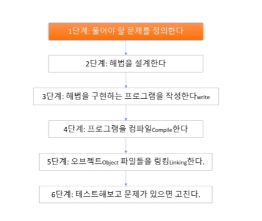
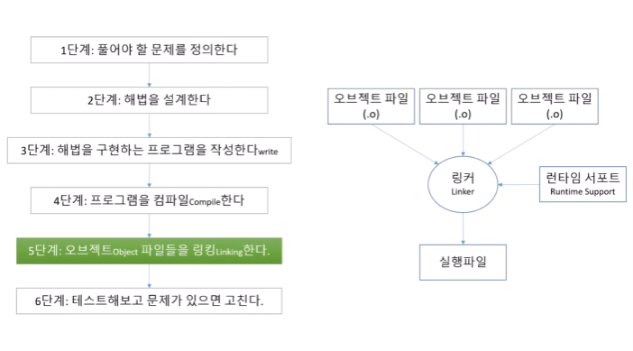

<!-- Heading -->
#  열아홉번째 도토리

<!-- Quote -->
> ## 언리얼 C++ 스크립팅을 위한 학습
>
> ### 홍정모의 따라 배우는 C++

이번 업로드는 인프런 유료강의 홍정모의 따라 배우는 C++를 참고합니다

<br>
안녕하세요 코드 지식이 모자라 다람쥐가 도토리 모으듯이 여기저기서 긁어 모아 사용하다가

숨겨 놓은 도토리 까먹듯이 맨날 자료 못찾아서 뒤적거리는 다람쥐코더입니다

<br>

무료 강의인 두들낙서님 강의를 듣다가 우연치 않게 홍정모님의 유료강의를 들을 기회가 생겨 시작합니다

~~(두들낙서님 죄송합니다)~~

<br>


## 시작해봅시다

### C++ 꼭 공부해야 할까?

이번 내용은 굳이 정리할 내용은 아닙니다 단순히 홍정모 강사님이 얘기하고 싶은 내용이고 무료이니 들어보시기 바랍니다

### 프로그래밍 언어란?

말그대로 "언어" 이고 기계어(Machine Language)의 개념으로 갑니다

Assembly Language는 직접적인 제어를 하는 저수준의 언어입니다

고수준의 언어로는 C, C++, Pascal, Java 등등 보통 프로그래밍에 사용되는 언어입니다

고수준이라고 무조건 좋은게 아니라 인간의 언어에 가깝다는 개념입니다

"컴파일러" 도 프로그래밍인데 고수준의 언어 코드를 실행파일로 번역하고 그 실행파일을 cpu가 실행 결과로 출력합니다

"인터프리터" 는 고수준 언어의 스크립트를 인터프리터를 통해 CPU로 바로 결과를 출력합니다 ( 반복 실행하면 더 느림 EX Python )

### C, C++ 언어 소개

이부분도 역사적인 유래 등의 내용으로 프로그래밍을 할땐 의도를 명확히 하라는 말씀을 듣고 일단 넘어갑니다



점점 저로써는 알아들을 수 없는 내용을 얘기해 주십니다



### 통합개발환경 기본 사용법

드디어 뭔가 시작합니다 우선 비주얼 스튜디오 설치를 시작하고

새로 만들기를 하여 데스크탑 Wizard로 파일을 생성합니다

Precompiled Header는 속도에 이점이 있다고 하셨지만 지금은 넘어가도록 합니다

소스파일에 새로운 cpp파일을 생성합니다

.h 헤더파일과 클래스 파일은 나중에 다룹니다

먼저 드디어 역사깊은 헬로월드를 칩니다

```C++
// 맨윗줄에 이렇게 적어주시고
#include <iostram>

int main()
{
    return 0;
}

```
이것이 가장 기본적인 C++ 작성법으로 빌드를 하면 정상 빌드 됩니다

로그를 보면 exe파일로 실행 결과가 출력된것을 보여줍니다

그 다음엔 검색창에 x64 native 프롬프트 콘솔창을 킵니다

그리고 체인지 디렉토리 cd를 치고 디버그 폴더를 드래그드랍하여 경로를 변경해줍니다

그리고 실행하면 방금 빌드한 콘솔 파일이 실행됩니다

지금까지 한것은 Visual studio가 지원해주는 기능으로 알고 쓰기위해 알려주신 내용입니다

간단한 출력을 위해 std::cout 기능을 사용했는데 앞으로 모르는게 생기면 검색하거나 오른쪽클릭해서 Go to Definition으로 자료를 찾아봅시다

그리고 << 입력하고 ""안에 출력하고 싶은 내용을 입력한후 << std::endl; 으로 코드를 끝냅니다

::는 네임스페이스 << 는 스트림으로 읽습니다

위의 버튼을 Debug -> Release를 하게되면 디버깅 작업은 하지 않게 됩니다

이 경우에는 Release 폴더가 따로 생성되고 베포용이기 때문에 디버깅 내용이 없어 용량이 굉장히 작습니다

실행 속도의 차이도 많이나게 됩니다 그리고 왠만하면 x64를 권장합니다

### 비쥬얼 스튜디오 솔류선, 프로젝트 관리

솔루션 안에 프로젝트가 포함되며

작업을 할땐 프로젝트 단위로 언어를 섞어서 사용 할수도 있습니다

이렇게 되면 생성된 솔루션 안에 프로젝트 안에 소스파일로 cpp파일과 헤더파일로 .h파일을 다루게됩니다

프로젝트 두개를 생성하고 빌드하면 로그에 두개가 출력되는데 왼쪽에 두꺼운 글씨로 표시된 프로젝트가 실행이 됩니다

### 코딩하다 막혔을때?

교수님께서는 막혔을때 당황하거나 화내지말고 냉정하게 로그창을 보고 차근차근 고치라고 조언해주십니다

가급적이면 개발 환경들이 도와주기 때문에 차근차근 알아보면 됩니다

그리고 검색을 활용하고 로그창을 그대로 긁어서 검색해도 자료가 뜹니다

다른 방법으로는 커뮤니티에 가서 도움을 요청하는 방법도 있습니다

질문글을 올리다보면 그 오류에 대한 정리를 하게되고 답이 떠오를수도 있습니다


## 이번 과정을 마치며

기초적인 내용이고 이런 과정을 처음듣는 사람들을 위한 내용인듯 하지만 저는 부족한 개발자이기 때문에

빠르게 한번더 들어봤습니다 바로 다음 강의를 이어서 업로드하겠습니다
