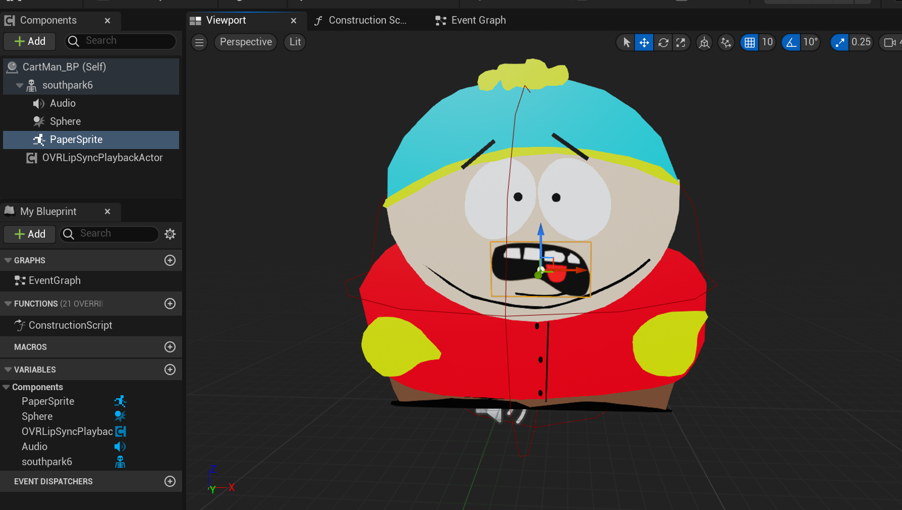
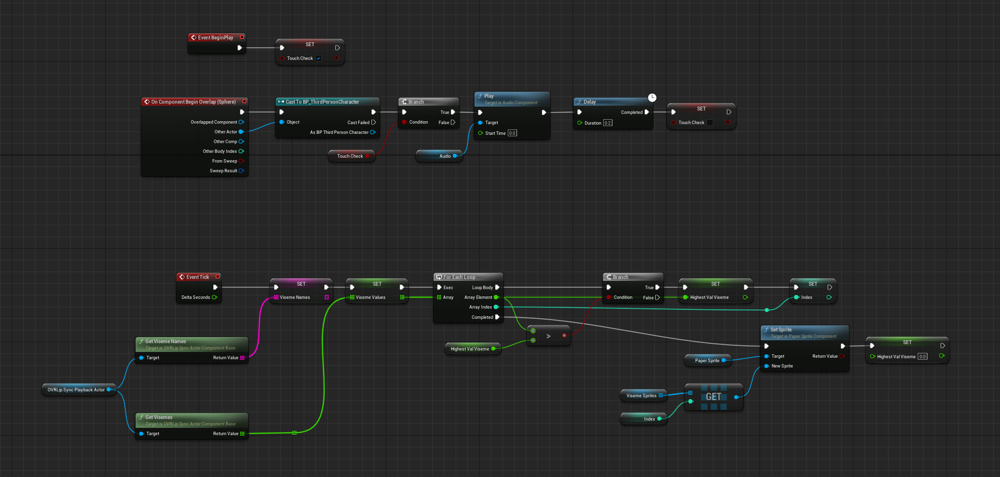
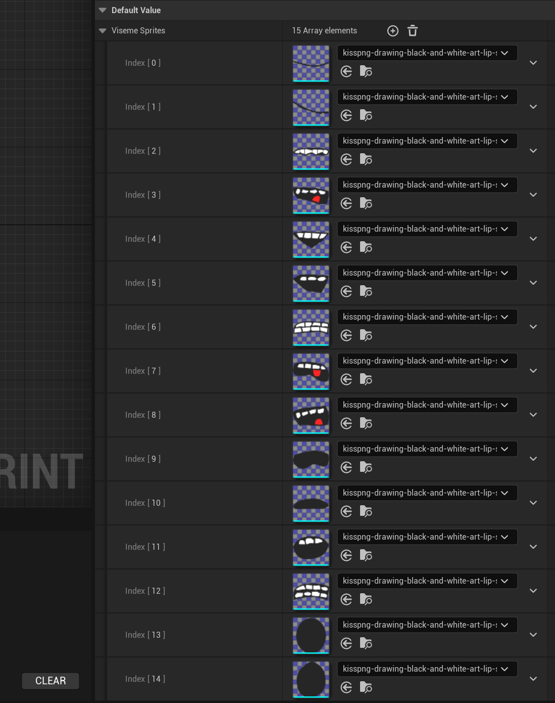

<!-- Heading -->
#  열여덟번째 도토리

<!-- Quote -->
> ## 언리얼 OVRlipsync Plugin을 2D 캐릭터와 연동해보기
>
> ### 버전 충돌 이슈 해결

이번 강의 내용은 언리얼 OVRlipsync Plugin을 2D 캐릭터에 연동시켜보겠습니다 립싱크 플러그인 사용 후엔

iphone의 Live Link 앱을 사용해 Face Tracking도 시도해보겠습니다

유튜브 [Fractured Fantasy님의 영상](https://www.youtube.com/watch?v=Gj5DBZpPDX0&t=1985s)을 참고하여 제작합니다

 
안녕하세요 코드 지식이 모자라 다람쥐가 도토리 모으듯이 여기저기서 긁어 모아 사용하다가

숨겨 놓은 도토리 까먹듯이 맨날 자료 못찾아서 뒤적거리는 다람쥐코더입니다

 

제가 좋아하는 사우스파크 캐릭터를 사용해서 언리얼에서 2D 캐릭터의 립싱크를 도전 합니다

 

### Blender 툴을 활용해 2D 캐릭터 임포트하기

상당히 오래걸린 작업이지만 작업 마치고 글을 다시 작성하는거라 생략하도록 하겠습니다

영상 초반에 블렌더 기초 사용법도 알려주시니 영상을 참고하도록 합시다

2D 캐릭터와 발음별 15개의 입모양을 Sprite Atlas로 임포트하고 음성 파일을 다운로드 하면

에셋 준비는 끝났습니다 이제 Cartman_BP를 생성하고 Sound와 OVRLipsyncPlaybackActor를 추가합니다

그리고 플레이어와 충돌로 디버깅할 예정이기 때문에 Sphere Collision도 넣고

PaperSprite를 적당한 위치에 조절하여 만들어 줍니다

그리고 블루프린트 코드는 이렇게 구성합니다

그리고 VisemeSprites의 Array에 각각 맞는 이미지를 넣어줍니다

이렇게 이미지를 넣고 실행하여 디버깅하면 카트먼이 음성에 맞춰 입모양을 따라 움직입니다

## 이번 과정을 마치며

OVRLipsync 기능이 정말 다양하게 있는듯 합니다 디테일 조정도 있고

특히 이번 2D 캐릭터의 입모양은 일반 3D 메타휴먼의 립싱크보다 훨씬 퀄리티가 있는 느낌이었습니다
