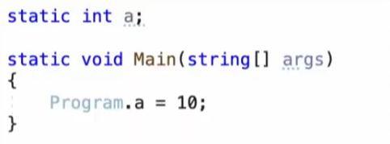

<!-- Heading -->
#  여섯번째 도토리

<!-- Quote -->
> ## 이론 정리
> 
> ### 18, 19, 20, 21, 22, 23, 24, 25, 26-1,2 강
<br>
안녕하세요 코드 지식이 모자라 다람쥐가 도토리 모으듯이 여기저기서 긁어 모아 사용하다가

숨겨 놓은 도토리 까먹듯이 맨날 자료 못찾아서 뒤적거리는 다람쥐코더입니다

<br>

계속해서 이론 정리 입니다

셀프코딩의 단계를 위하여!

유튜브에서 눈코딩 이라는 분의 C#강의 계속해서 봅니다

<br>

이 포스팅은 유튜브 눈코딩 님의 **[유니티C#](https://imgur.com/d96nlwG)**
강의 영상을 참고 하였습니다

<br>
바로 들어갑니다

<hr>
<!-- Numbered list -->

##18편 입력받기

**버퍼 (Buffer)**

데이터를 한곳에서 다른 한 곳으로 전송하는 동안 일시적으로

그 데이터를 보관하는 메모리의 영역

**스트림 (Stream)**

데이터가 순서대로 전송되도록 보장하는 데이터의 흐름

영상보고 나니 저의 Unity 프로그래밍과는 관련이 없는 내용이었네요

입력받는 개념만 챙겨가도록 하겠습니다



입력해주세요 문구를 띄운뒤

string형식으로 input변수를 선언하고 값을 입력받아 삽입합니다 Console.ReadLine(); (엔진에서는 다른걸로)

Console.WriteLine(input); 으로 입력받은 값을 출력합니다

그뒤에는 입력 시스템에 대해 설명해주십니다 이번강의는 빠르게 넘어가도록합니다

<hr>

## 19편 산술 연산자

일반적인 수학 연산과 비슷한 연산자의 집합이다

단항으로는 ++증가, --감소, +더하기, -빼기

이항으로는 +더하기, -빼기 *곱하기, /나누기, %나머지로

모든 정수 및 소수점 숫자 형식을 지원합니다

먼저 증가 연산자입니다

전위 ++x와 후위 x++가 있으며

후위 증가 연산자는

피 연산자 값을 다른 연산에 먼저 사용하고 값을 1 증가시킵니다

반대로 전위 증가 연산자는

피 연산자 값을 1증가 시키고 다른 연산에 사용합니다

그대로 --x는 전위 감소 연산자, x--는 후위 감소 연산자입니다

나머지 +, -, *, / 더하기 빼기 곱하기 나누기는 전부 우리가 아는대로 사용하지만

%는 나눈 값의 나머지를 출력합니다

추가로 나오는 복합연산자의 개념입니다

앞에 수식으로 알려주시는데 이것보다는

아래 코드를 보는게 이해가 빠릅니다
```c#
int a = 5;
a += 9;
//출력값은 14입니다

int a = 5;
a = a + 9;
// 마찬가지로 출력값은 14로 동일합니다
```

마지막으로 일반 수학처럼 괄호()안의 연산 먼저 처리합니다

<hr>

##15편 비교 연산자

변수 앞에는 변수 타입이 붙습니다 어떤 값을 변수에 넣을지 고민 후에 변수 타입을 지정합니다

그리고 값에는 종류가 있고 종류에따라 사용하는 키워드가 다릅니다

그리고 평소에 쓰던 미리 정의되어 있는 키워드 이외에도 사용자가 직접 타입을 만들 수도 있습니다

바로 전에 배운 상수들을 묶어서 열거형이라는 이름으로 사용자 정의 타입을 만들어 봅니다

**열거형은 상수들의 집합**입니다

열거형을 정의하려면 enum 키워드를 정의하고 열거형 멤버의 이름을 지정합니다

```c#
enum Animal
{
    // 내부값은 모두 상수입니다
    // 0으로 시작하고 정의된 텍스트 순서에 따라 1씩 증가합니다
    Dog,
    Cat,
    Squirrel,
    Snake
}
```
기본적으로 열거형 멤버의 연결된 상수 값은 int 형식입니다

연결된 상수 값을 명시적으로 지정할 수도 있습니다
```c#
enum Animal
{
    Dog = 10,
    Cat = 20,
    Squirrel = 50,
    Snake = 100
}
```
위와 같이 열거 형식을 정의한다는 것은 새로운 타입 정의를 의미 합니다

### 변수 정의와 완전 다른 내용입니다

열거형식 정의는 class내부 또는 namespace내부 에서 합니다

그리고 직접 실행 하고 영상은 끝이 납니다

```c#
// 열거형식 변수 정의
Animal animal;

// 열거형식 변수에 값 할당
animal = Animal.Squirrel;

// 출력값 Squirrel
Debug.Log(animal);

// 값도 변경해보기
animal = Animal.Snake;

// 출력값 Snake
Debug.Log(animal);

// 열거형 변수의 값은 할당된 열거형 멤버 이름으로 출력 됩니다
```
<hr>
<!-- Numbered list -->

##14편 형식 변환

변수가 선언된 후에는 다시 선언되거나 다른 형식의 값이 할당될 수 없습니다

(형식이 변수의 형식으로 암시적으로 변환될 수 있는 경우는 예외)

예를 들어 string은 int로 암시적 변환이 불가능합니다

형식을 변환하는데는 두가지 방법이 있습니다

```c#
int hp = 12;
float damage = 12.3f;

hp = (int)12.3f; // 명시적 변환

damage = 23; // 암시적 변환
```
사용법도 여러가지가 있습니다

**정수를 실수로 변환** ~~(mistake)~~
```c#
int hp = 12;
float temp = Convert.ToSingle(hp);
// 정수값이 실수값인 12.0f로 변환됨
```
**실수를 정수로 변환** 
```c#
float damage = 5.8f;
int temp = Convert.ToInt32(damage);
// 6으로 변환됨
// 두 정수 사이의 값이면 짝수 값을 반환합니다 4.5는 4로 5.5는 6으로 변환됩니다
```
**정수를 문자열로 변환**
```c#
int hp = 10;
string temp = hp.ToString();
// "10"으로 변환됨
```
**문자열을 정수로 변환**
```c#
string str = "123";
int num = Convert.ToInt32(str);
// 123으로 변환됨
```
**문자열을 실수로 변환** 
```c#
string str = "12.3";
float num = Convert.ToSingle(str);
// 12.3으로 변환됨
// 문자열에 포함되는 숫자 형식만 가능합니다
```
**정수를 문자로 변환**
```c#
int num = 65;
char word = Convert.ToChar(num);
// 'A'로 변환됨
```
그리고 직접 실행 후 영상은 끝납니다

전부 외울 수 없으니 적어두고 나중에 참고하기로 합니다

<hr>

##15편 문자열 보간

이번 영상엔 바로 예제 코드를 실행하셨다
```c#
// 문자열 변수 name 선언
string name; // 변수 정의

name = "다람쥐코더"; // 변수에 값 할당

Debug.Log($"{name}의 블로그");
// $와 쌍따옴표사이에 공백이 있어서는 안되며 중괄호의 짝을 확인해야 합니다

// 출력문 하나에 여러 변수 출력하기

int Dotori;
Dotori = 5;
Debug.Log($"{name}의 {Dotori}번째 포스팅");
// 다람쥐코더의 5번째 포스팅으로 출력완료


// 다른 방법
// 이방법은 Debug.Log로는 출력에 오류가 있는듯 합니다
string name = "다람쥐코더";
int dotori = 5;

// Debug.Log는 무시하고 뒤의 형식만 알아갑시다
Debug.Log("{0}번째 포스팅을 올린 {1}입니다.",  dotori, name);        
```
영상에서 배운걸로는 조금 모자라서 자료를 찾아봤다

LAYER6AI님의 [끝나지 않는 프로그래밍 일기](https://youtu.be/bqNW08Tac0Y) 블로그 자료에서

영상에 나온 두번째 방식이 복합 형식 지정이라는 방법이란걸 알게 되었고

이 방법보다는 첫번째 방법인 문자열 보간이 직관적이라고 한다

<!-- Image -->


요런 짤막한 팁도 있으니 챙겨가도록 하자

<hr>
<!-- Numbered list -->

## 16편 값형식과 참조형식 

변수는 저장된 값의 메모리 주소입니다 프로그램이 실행되면 크게 2개의 메모리 영역을 사용합니다

<br>

첫번째 메모리 영역의 이름은 **스택 메모리**입니다

**스택**은 가장 **나중에 넣은 데이터를** 가장 **먼저 꺼내는** 선형적 구조 입니다

<br>

두번째 메모리 영역의 이름은 **힙 메모리**입니다

힙은 **계층적** 구조입니다 **임의의 순서로 저장**됩니다

<br>

변수가 선언되면 스택 메모리에 공간이 할당됩니다

변수에 값을 할당 한다는 것은 메모리에 값을 저장한다는 뜻입니다

모든 값이 스택 메모리에 저장 되는 것은 아닙니다

어떤 값들은 힙 메모리에 저장됩니다

**스택에 값이 직접 저장**되는 형식을 **값형식** 이라고 부릅니다

힙에 값이 저장되는 형식을 참조형식 이라고 부릅니다

참조형식은 스택과 힙 메모리 모두를 사용합니다

**힙**에는 **값**을 **스택**에는 **값의 주소**를 저장합니다

값을 참조 한다고 해서 참조 형식이라고 부릅니다

**값형식**은 **스택에 값이 직접 저장**됩니다

참조형식은 다음과 같습니다 string, object

마찬가지로 **참조형식**의 **값은 힙메모리**에 **값의 주소는 스택**에 저장됩니다

null은 아무것도 참조하지 않는 **값**이며 **참조 형식 변수의 기본값**입니다

값은 변수에 할당이 가능하구요

string은 참조형식이므로 string변수에 null값 할당이 가능합니다

```c#
string name = null;
```

생각보다는 긴 내용의 텍스트가 3분23초 동안 나오는데 영상의 핵심은

 ### "값형식은 스택에 참조형식은 힙에 값이 저장된다" 입니다

<hr>

## 17편 박싱과 언박싱

Boxing은 값 형식을 object형식으로 변환하는 프로세스 입니다

Boxing은 값을 내부에 래핑하고 힙에 저장합니다

값형식은 값이 직접 스택에 저장됩니다

값형식의 값을 Boxing하면 래핑해서 힙에 저장합니다

Boxing은 암시적이며 UnBoxing은 명시적입니다

Boxing
```c#
int i = 123;
object obj = i;
```
Unboxing
```c#
int i = 123; // 값 형식
object obj = i; // 암시적 박싱
int j = (int)obj; // 명시적 언박싱
```

도대체 이해가 안가서 따로 자료를 찾아봤다 이번엔 여러 사이트를 돌아다녔고

ArrayList와 같이 여러타입의 자료를 저장하게 되면 값을 가져올 때 박싱이 되는데
이때 박싱되기 전 자료형으로 명확히 캐스팅도 해줘야해서 형식 불안정성도 증가되고
뭐 아무튼 피해야 한다고 한다

## 오늘 정리를 마치며

하루종일 이론만 정리하고 이해하려고 하니 막바지엔 집중력도 흐려지고 이해력도 떨어졌다
이론 정리는 하루 5개정도로만 하고 예제로 실력 키우는게 나을것 같다